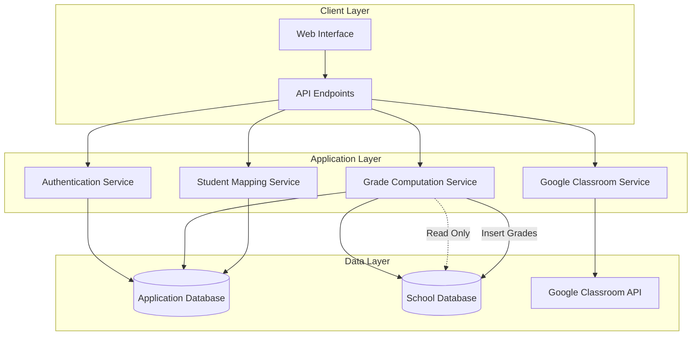

# Design Document

## Overview

The Faculty Grading System is a Laravel 12 application that provides a comprehensive grading interface for faculty members at Lorma Colleges. The system integrates with existing school databases and Google Classroom to streamline the grading process while maintaining data integrity through a dual-database architecture.

### Key Design Principles

- **Separation of Concerns**: Application data stored separately from existing school database
- **Data Integrity**: Read-only access to school database with controlled grade insertion
- **Scalability**: Modular architecture supporting multiple database connections
- **Security**: OAuth-based authentication with domain restrictions
- **Usability**: Intuitive matrix-based grading interface

## Architecture

### High-Level Architecture



### Database Architecture

The system employs a dual-database strategy:

1. **Application Database**: Stores all application-specific data including grade computations, student mappings, activity configurations, and user sessions
2. **School Database**: Existing database used for reading faculty assignments, student data, and inserting final computed grades

### Technology Stack

- **Framework**: Laravel 12
- **Authentication**: Laravel Socialite with Google OAuth
- **Database**: MySQL/MariaDB for both databases
- **Frontend**: Blade templates with Alpine.js for interactivity
- **API Integration**: Google Classroom API v1
- **Caching**: Redis for session management and API response caching

## Components and Interfaces

### Authentication System

#### GoogleAuthController
- Handles OAuth flow with Google
- Validates @lorma.edu domain restriction
- Creates/updates faculty sessions

#### AuthMiddleware
- Validates active faculty sessions
- Enforces domain restrictions
- Handles session expiration

### Grade Management System

#### GradeController
- Manages grade input interface
- Handles CRUD operations for activities and scores
- Coordinates grade computation and storage

#### GradeComputationService
- Implements configurable grade computation formulas
- Handles term-specific calculations (Prelims, Midterm, Finals)
- Computes final ratings and class standings

#### GradeStorageService
- Manages dual-database operations
- Handles application database storage for computations
- Manages school database grade insertion

### Google Classroom Integration

#### GoogleClassroomService
- Authenticates with Google Classroom API
- Fetches faculty classes and student rosters
- Retrieves assignments and grades from GCR

#### ClassroomSyncController
- Manages GCR to school database synchronization
- Handles class matching and student mapping
- Provides manual override capabilities

### Student Mapping System

#### StudentMappingService
- Implements automatic student matching algorithms
- Manages manual mapping interface
- Stores and retrieves mapping configurations

#### MappingController
- Provides mapping management interface
- Handles bulk mapping operations
- Manages mapping conflict resolution

### Subject Management

#### SubjectController
- Manages subject configuration (lecture-only vs lecture+lab)
- Handles subject-specific grading rules
- Manages activity organization

#### SubjectService
- Retrieves faculty assignments from school database
- Manages subject metadata and configurations
- Handles historical data access

## Data Models

### Application Database Models

#### Faculty
```php
class Faculty extends Model
{
    protected $fillable = [
        'google_id',
        'email',
        'name',
        'school_faculty_id', // Reference to school DB
        'access_token',
        'refresh_token'
    ];
}
```

#### Subject
```php
class Subject extends Model
{
    protected $fillable = [
        'school_subject_id', // Reference to school DB
        'faculty_id',
        'subject_code',
        'subject_name',
        'section',
        'type', // 'lecture_only' or 'lecture_lab'
        'academic_year',
        'semester',
        'gcr_class_id'
    ];
}
```

#### Activity
```php
class Activity extends Model
{
    protected $fillable = [
        'subject_id',
        'name',
        'type', // 'lecture' or 'lab'
        'term', // 'prelim', 'midterm', 'finals'
        'max_score',
        'weight',
        'gcr_assignment_id'
    ];
}
```

#### StudentMapping
```php
class StudentMapping extends Model
{
    protected $fillable = [
        'subject_id',
        'school_student_id', // Reference to school DB
        'gcr_student_id',
        'student_name',
        'student_email',
        'mapping_confidence' // For automatic matching quality
    ];
}
```

#### GradeRecord
```php
class GradeRecord extends Model
{
    protected $fillable = [
        'student_mapping_id',
        'activity_id',
        'score',
        'max_score',
        'percentage',
        'term',
        'created_by'
    ];
}
```

#### TermGrade
```php
class TermGrade extends Model
{
    protected $fillable = [
        'student_mapping_id',
        'subject_id',
        'term',
        'class_standing',
        'exam_score',
        'exam_grade',
        'term_grade',
        'computation_config' // JSON field for formula used
    ];
}
```

#### FinalRating
```php
class FinalRating extends Model
{
    protected $fillable = [
        'student_mapping_id',
        'subject_id',
        'prelim_grade',
        'midterm_grade',
        'finals_grade',
        'final_rating',
        'academic_year',
        'semester'
    ];
}
```

### School Database Models (Read-Only)

#### SchoolFaculty
```php
class SchoolFaculty extends Model
{
    protected $connection = 'school_db';
    protected $table = 'faculty'; // Actual table name in school DB
    
    public function subjects()
    {
        return $this->hasMany(SchoolSubjectAssignment::class);
    }
}
```

#### SchoolStudent
```php
class SchoolStudent extends Model
{
    protected $connection = 'school_db';
    protected $table = 'students'; // Actual table name in school DB
}
```

#### SchoolGrade (Insert Only)
```php
class SchoolGrade extends Model
{
    protected $connection = 'school_db';
    protected $table = 'grades'; // Actual table name in school DB
    
    protected $fillable = [
        'student_id',
        'subject_id',
        'prelim_grade',
        'midterm_grade',
        'finals_grade',
        'final_rating',
        'academic_year',
        'semester'
    ];
}
```

## Error Handling

### Database Connection Management
- Implement connection pooling for both databases
- Handle connection failures gracefully with appropriate fallbacks
- Provide clear error messages for database connectivity issues

### API Integration Error Handling
- Implement retry mechanisms for Google Classroom API calls
- Handle rate limiting and quota exceeded scenarios
- Provide fallback options when external services are unavailable

### Grade Computation Error Handling
- Validate input data before computation
- Handle division by zero and invalid score scenarios
- Provide detailed error messages for computation failures

### Data Integrity Protection
- Implement transaction management for multi-database operations
- Validate data consistency between application and school databases
- Provide rollback mechanisms for failed operations

## Testing Strategy

### Unit Testing
- Test grade computation algorithms with various input scenarios
- Test student mapping algorithms for accuracy
- Test database model relationships and constraints
- Test API service methods with mocked responses

### Integration Testing
- Test dual-database operations and transactions
- Test Google Classroom API integration with real API responses
- Test authentication flow with OAuth providers
- Test grade synchronization between databases

### Feature Testing
- Test complete grading workflows from login to grade submission
- Test student mapping workflows with various data scenarios
- Test subject configuration and activity management
- Test error handling and recovery scenarios

### Performance Testing
- Test application performance with large student datasets
- Test database query optimization for grade computations
- Test API response times and caching effectiveness
- Test concurrent user scenarios and resource utilization

### Security Testing
- Test authentication and authorization mechanisms
- Test data access controls and permission enforcement
- Test input validation and sanitization
- Test protection against common web vulnerabilities

## Configuration Management

### Environment Configuration
```env
# Application Database
DB_CONNECTION=mysql
DB_HOST=localhost
DB_PORT=3306
DB_DATABASE=faculty_grading
DB_USERNAME=app_user
DB_PASSWORD=secure_password

# School Database
SCHOOL_DB_CONNECTION=mysql
SCHOOL_DB_HOST=school_db_host
SCHOOL_DB_PORT=3306
SCHOOL_DB_DATABASE=school_system
SCHOOL_DB_USERNAME=readonly_user
SCHOOL_DB_PASSWORD=readonly_password

# Google OAuth
GOOGLE_CLIENT_ID=your_client_id
GOOGLE_CLIENT_SECRET=your_client_secret
GOOGLE_REDIRECT_URI=https://your-domain.com/auth/google/callback

# Google Classroom API
GOOGLE_CLASSROOM_SCOPES=https://www.googleapis.com/auth/classroom.courses.readonly,https://www.googleapis.com/auth/classroom.rosters.readonly

# Grade Computation Configuration
GRADE_COMPUTATION_PRELIM_CLASS_WEIGHT=0.4
GRADE_COMPUTATION_PRELIM_EXAM_WEIGHT=0.6
GRADE_COMPUTATION_MIDTERM_CLASS_WEIGHT=0.4
GRADE_COMPUTATION_MIDTERM_EXAM_WEIGHT=0.6
GRADE_COMPUTATION_FINALS_CLASS_WEIGHT=0.4
GRADE_COMPUTATION_FINALS_EXAM_WEIGHT=0.6
GRADE_COMPUTATION_FINAL_PRELIM_WEIGHT=0.3
GRADE_COMPUTATION_FINAL_MIDTERM_WEIGHT=0.3
GRADE_COMPUTATION_FINAL_FINALS_WEIGHT=0.4
```

### Database Configuration
```php
// config/database.php additions
'school_db' => [
    'driver' => 'mysql',
    'host' => env('SCHOOL_DB_HOST', '127.0.0.1'),
    'port' => env('SCHOOL_DB_PORT', '3306'),
    'database' => env('SCHOOL_DB_DATABASE', 'school_system'),
    'username' => env('SCHOOL_DB_USERNAME', 'root'),
    'password' => env('SCHOOL_DB_PASSWORD', ''),
    'charset' => 'utf8mb4',
    'collation' => 'utf8mb4_unicode_ci',
    'prefix' => '',
    'strict' => true,
    'engine' => null,
],
```

## Security Considerations

### Authentication Security
- Implement OAuth 2.0 with Google for secure authentication
- Enforce @lorma.edu domain restrictions at multiple levels
- Use secure session management with proper expiration
- Implement CSRF protection for all forms

### Data Access Security
- Use read-only database connections for school database queries
- Implement proper authorization checks for all grade operations
- Validate user permissions before allowing grade modifications
- Log all grade-related operations for audit trails

### API Security
- Implement rate limiting for Google Classroom API calls
- Use secure token storage and refresh mechanisms
- Validate all API responses before processing
- Implement proper error handling to prevent information disclosure

### Data Protection
- Encrypt sensitive data in the application database
- Implement proper backup and recovery procedures
- Use secure communication channels (HTTPS) for all operations
- Implement data retention policies for grade records