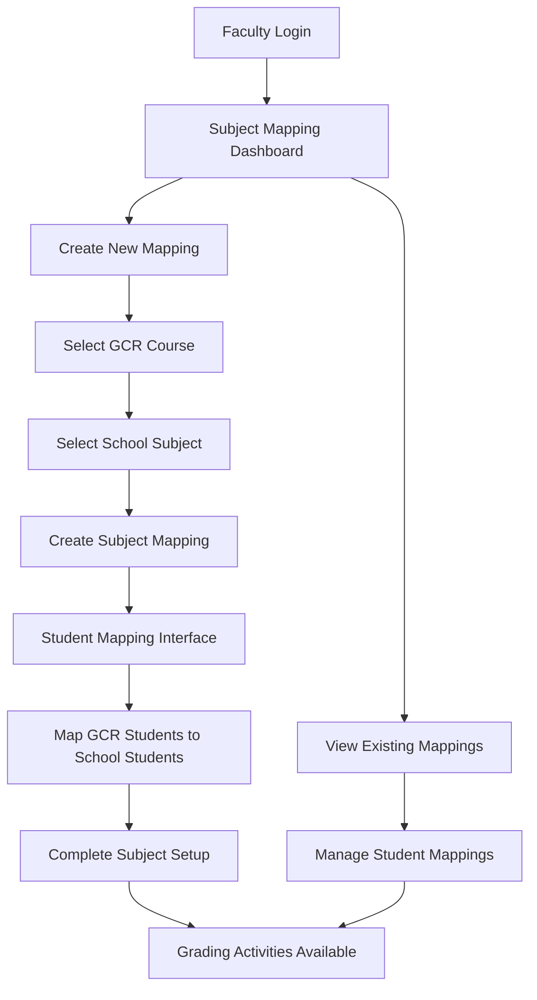
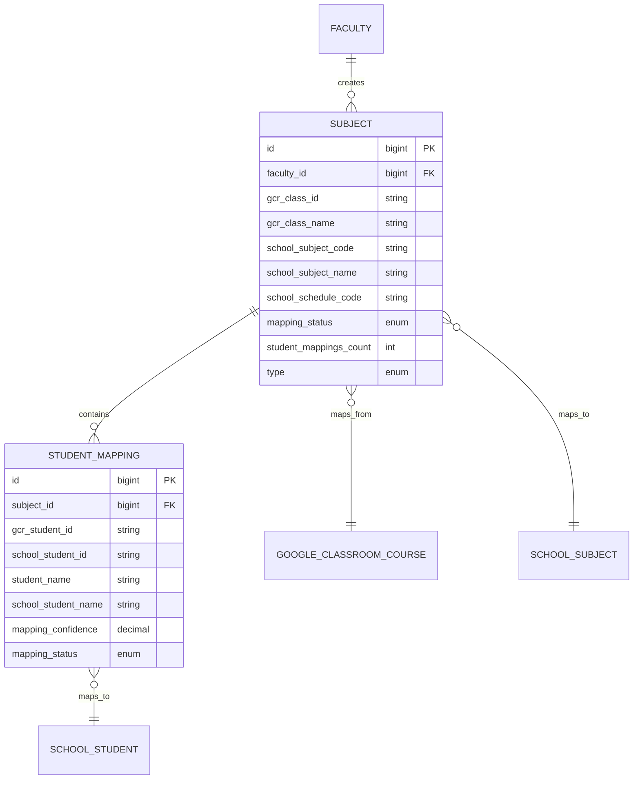

# Subject Mapping Workflow Design

## Overview

This design document outlines the architecture for a mapping-based subject creation system that replaces manual subject creation. The system creates subjects by mapping Google Classroom courses with school database subjects, then maps students between both systems. All grading activities are based on these mappings.

## Architecture

### High-Level Flow



### System Components

1. **SubjectMappingService** - Core business logic for mapping operations
2. **SubjectMappingController** - HTTP interface for mapping operations
3. **GoogleClassroomService** - Integration with Google Classroom API
4. **SchoolDatabaseService** - Integration with legacy school database
5. **StudentMappingService** - Student-level mapping operations
6. **Subject Model** - Enhanced to support mapping metadata
7. **StudentMapping Model** - Relationship between GCR and school students

## Components and Interfaces

### SubjectMappingService

**Purpose:** Orchestrates the subject mapping workflow

**Key Methods:**
- `getAvailableGoogleClassroomCourses(string $facultyEmail): array`
- `getAvailableSchoolSubjects(string $facultyId, string $academicYear, string $semester): array`
- `createSubjectMapping(array $mappingData): array`
- `getStudentsForMapping(Subject $subject): array`
- `saveStudentMappings(Subject $subject, array $mappings): array`
- `suggestStudentMappings(array $gcrStudents, array $schoolStudents): array`
- `getMappingStatistics(int $facultyId): array`

**Dependencies:**
- GoogleClassroomService
- SchoolDatabaseService
- Subject Model
- StudentMapping Model

### SubjectMappingController

**Purpose:** HTTP interface for mapping operations

**Routes:**
- `GET /subjects/mapping` - Dashboard and mapping interface
- `POST /subjects/mapping` - Create new subject mapping
- `GET /subjects/mapping/{subject}/students` - Student mapping interface
- `POST /subjects/mapping/{subject}/students` - Save student mappings
- `DELETE /subjects/mapping/{subject}` - Delete mapping
- `GET /subjects/mapping/gcr-courses` - AJAX: Get available GCR courses
- `POST /subjects/mapping/school-subjects` - AJAX: Get school subjects by period
- `GET /subjects/mapping/statistics` - AJAX: Get mapping statistics

### Enhanced Subject Model

**New Fields:**
```php
// Google Classroom mapping
'gcr_class_id' => 'string|nullable',
'gcr_class_name' => 'string|nullable',

// School database mapping  
'school_subject_code' => 'string|nullable',
'school_subject_name' => 'string|nullable',
'school_schedule_code' => 'string|nullable',

// Mapping metadata
'mapping_status' => 'enum:pending_student_mapping,completed,needs_review',
'student_mappings_count' => 'integer|default:0',
'mapping_notes' => 'text|nullable',
'type' => 'enum:lecture_only,lecture_lab,lab_only,mapped'
```

**Relationships:**
```php
public function studentMappings(): HasMany
{
    return $this->hasMany(StudentMapping::class);
}

public function mappedStudents(): HasManyThrough
{
    return $this->hasManyThrough(SchoolStudent::class, StudentMapping::class, 
        'subject_id', 'student_id', 'id', 'school_student_id');
}
```

### StudentMapping Model

**Purpose:** Links Google Classroom students with school database students

**Fields:**
```php
'subject_id' => 'foreignId:subjects',
'gcr_student_id' => 'string', // Google Classroom student ID
'school_student_id' => 'string', // School database student ID
'student_name' => 'string', // GCR student name
'school_student_name' => 'string', // School database student name
'gcr_student_email' => 'string|nullable',
'mapping_confidence' => 'decimal:3,2|default:1.0', // 0.0 to 1.0
'mapping_status' => 'enum:suggested,confirmed,manual',
'mapped_by' => 'foreignId:faculty|nullable',
'mapped_at' => 'timestamp|nullable'
```

### User Interface Components

#### Subject Mapping Dashboard
- Statistics cards (total mappings, pending, completed, student mappings)
- List of existing mappings with status indicators
- Quick actions (map students, view subject, delete mapping)
- Create new mapping button

#### Subject Mapping Modal
- Academic year and semester selection
- Google Classroom course dropdown (filtered)
- School database subject dropdown (filtered by period)
- Notes field for mapping context
- Real-time validation

#### Student Mapping Interface
- Side-by-side display of GCR and school students
- Suggested mappings with confidence scores
- Manual mapping controls
- Bulk actions for confirmed mappings
- Progress indicator

## Data Models

### Subject Mapping Flow



### Grading Integration

All grading components will be updated to use mappings:

1. **Activities** - Student lists based on StudentMapping
2. **Grade Ledger** - Display both GCR and school names
3. **Term Grades** - Use school student data for official records
4. **Grade Sync** - Use GCR student data for Classroom sync
5. **Reports** - Primary source: school database students

## Error Handling

### API Integration Errors
- Google Classroom API failures: Graceful degradation with cached data
- School database connection issues: Clear error messages with retry options
- Rate limiting: Queue requests and show progress indicators

### Validation Errors
- Duplicate mappings: Prevent and show clear error messages
- Missing required fields: Highlight and guide user to completion
- Invalid academic periods: Validate against school calendar

### Data Consistency
- Transaction-based operations for mapping creation
- Rollback on partial failures
- Audit logging for mapping changes

## Testing Strategy

### Unit Tests
- SubjectMappingService methods
- Student matching algorithms
- Validation logic
- Model relationships

### Integration Tests
- Complete mapping workflow
- Google Classroom API integration
- School database integration
- Grade computation with mappings

### Feature Tests
- Subject mapping controller endpoints
- Student mapping interface
- Dashboard statistics
- Error handling scenarios

### Performance Tests
- Large student list handling
- Concurrent mapping operations
- Database query optimization

## Security Considerations

### Access Control
- Faculty can only map their own courses
- Mapping deletion requires confirmation
- Student data privacy protection

### Data Validation
- Input sanitization for all mapping data
- Academic period validation
- Student ID format validation

### API Security
- Google Classroom OAuth token management
- School database connection encryption
- Rate limiting and request throttling

## Migration Strategy

### Phase 1: Parallel Operation
- Deploy mapping system alongside existing subject creation
- Allow faculty to test mapping workflow
- Maintain existing subjects as "legacy"

### Phase 2: Migration Tools
- Provide tools to convert existing subjects to mappings
- Data validation and cleanup utilities
- Backup and rollback procedures

### Phase 3: Full Transition
- Remove manual subject creation interface
- Redirect all subject creation to mapping workflow
- Archive legacy subject creation code

## Performance Considerations

### Caching Strategy
- Cache Google Classroom course lists
- Cache school database subject lists
- Cache student mapping suggestions

### Database Optimization
- Indexes on mapping fields
- Efficient queries for student lists
- Pagination for large datasets

### API Optimization
- Batch requests to Google Classroom
- Connection pooling for school database
- Asynchronous processing for large operations

## Monitoring and Analytics

### Key Metrics
- Mapping completion rates
- Student mapping accuracy
- API response times
- Error rates by operation type

### Logging
- Mapping creation and deletion events
- Student mapping changes
- API integration failures
- Performance bottlenecks

### Alerts
- High error rates
- API quota approaching limits
- Database connection issues
- Unusual mapping patterns